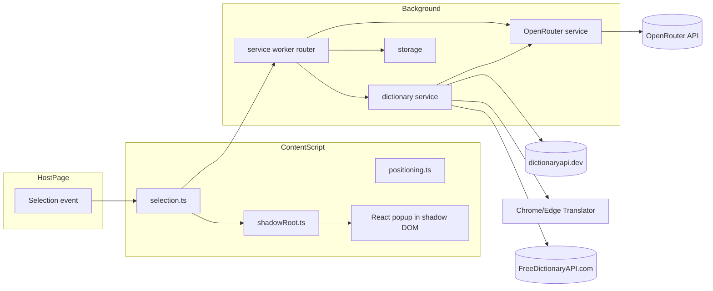

# ExtentionTranslate

A production-ready Chrome / Edge browser extension (Manifest V3) that lets you instantly look up the meaning of any English word or phrase by simply selecting text on a webpage.

The popup UI is inspired by professional dictionary extensions — clean information hierarchy, IPA pronunciation (UK / US), part-of-speech tags, CEFR level, examples with the searched word highlighted, related phrases, and synonyms. Dictionary data starts from dictionaryapi.dev; Chrome/Edge's on-device Translator handles display-language translation first, followed by FreeDictionaryAPI.com and then OpenRouter when needed. The Dictionary tab can display English, Vietnamese, or Simplified Chinese. A separate **OpenRouter** tab streams deep contextual explanations using only the configured system prompt.

## ✨ Features

- **Instant dictionary popup** when you select text on any webpage.
- **Shadow DOM isolation** so host page CSS cannot break the UI.
- **English, Vietnamese, and Simplified Chinese** dictionary display with IPA / audio buttons.
- **OpenRouter AI** integration in a separate tab with streamed Markdown/GFM responses and optional model thinking.
- **Optional automatic Ask AI** when a new popup opens; disabled by default to prevent unexpected API usage.
- **Reliable pronunciation** with trusted-click playback, background preload, and UK/US source fallback.
- **Polished shadcn/ui + Tailwind CSS** design.
- **Smart popup placement** that adapts to viewport edges, scrolling, resize and zoom.
- **Toggle** to enable / disable auto-popup-on-selection (synced live across tabs).
- **Keyboard accessible**, screen-reader friendly, Esc-to-close, click-outside-to-close.
- **Bounded lookup cache** to avoid redundant network calls.
- **Robust error handling** for offline / rate-limit / bad API key / unknown model.
- **Settings page** with password-style API key input, model picker, system prompt editor.

## 🏗 Architecture



- **Content Script** (`src/content/`): Detects text selection, builds a Shadow DOM host on demand, renders the React popup, shows the dictionary source immediately, and runs feature-detected Chrome/Edge translation with a persistent cache.
- **Background Service Worker** (`src/background/`): The only place that holds the OpenRouter API key and makes outbound HTTP requests. It returns dictionaryapi.dev data first, tries FreeDictionaryAPI.com before OpenRouter for remote translation, and loads settings from `chrome.storage.local` on each call.
- **Dictionary Service** (`src/services/dictionary/`): Fetches and parses dictionaryapi.dev, adapts the browser Translator API, and recursively reads FreeDictionaryAPI.com sense translations as a partial fallback.
- **OpenRouter Service** (`src/services/openrouter/`): Uses the OpenAI-compatible `https://openrouter.ai/api/v1/chat/completions` endpoint with SSE streams for separate answer and readable reasoning chunks. AI-tab formatting follows the saved System Prompt; Dictionary translations use a separate structured JSON request.
- **Storage Service** (`src/services/storage/`): Single typed wrapper around `chrome.storage.local`. The rest of the code never calls `chrome.storage` directly.
- **Settings Page** (`src/settings/`): Standalone SPA rendered via the Vite HTML pipeline. Opens in a new tab via `chrome.runtime.openOptionsPage()`.

## 📁 Project Structure

```
.
├── index.html                       # Vite entry for the Settings page (renamed to settings.html on build)
├── package.json
├── postcss.config.js
├── tailwind.config.js
├── tsconfig.json
├── vite.config.ts
├── public/
│   ├── manifest.json                # Manifest V3
│   └── icons/                       # source.png + auto-resized 16/48/128 PNGs
├── assets/
│   └── source-icon.png              # Original artwork; resized by generate-icons.mjs
├── scripts/
│   └── generate-icons.mjs           # Generates icon PNGs during build/postinstall
└── src/
    ├── background/
    │   └── index.ts                 # Service worker — message router + OpenRouter proxy
    ├── components/
    │   ├── dictionary/
    │   │   ├── AISection.tsx
    │   │   ├── MarkdownContent.ts
    │   │   ├── DictionaryHeader.tsx
    │   │   ├── DictionaryPopup.tsx
    │   │   ├── DictionarySkeleton.tsx
    │   │   ├── EmptyState.tsx
    │   │   ├── ErrorState.tsx
    │   │   └── MeaningSection.tsx
    │   └── ui/                      # shadcn/ui primitives (Button, Input, Switch, …)
    ├── content/
    │   ├── index.tsx                # Content entry — selection → popup lifecycle
    │   ├── positioning.ts           # Viewport-aware placement
    │   ├── selection.ts             # Selection extraction + sentence context
    │   └── shadowRoot.ts            # Mounts the closed Shadow DOM host
    ├── services/
    │   ├── dictionary/
    │   │   ├── browserTranslator.ts # Chrome/Edge Translator adapter
    │   │   ├── cache.ts             # In-memory source cache
    │   │   ├── freeDictionary.ts    # Fetch + parse dictionaryapi.dev
    │   │   ├── freeDictionaryApi.ts # FreeDictionaryAPI.com parser/fetcher
    │   │   ├── remoteFallback.ts    # FreeDictionaryAPI -> OpenRouter chain
    │   │   └── translationWorkflow.ts # Cache -> browser -> remote workflow
    │   ├── openrouter/
    │   │   └── client.ts            # OpenRouter /chat/completions client
    │   └── storage/
    │       └── settings.ts          # chrome.storage.local wrapper
    ├── settings/
    │   ├── App.tsx                  # Settings UI (React)
    │   └── main.tsx                 # Settings entry
    ├── shared/
    │   ├── constants.ts             # Message types, sizing, endpoint URLs
    │   ├── errors.ts                # ExtensionError + error-code mapping
    │   ├── types.ts                 # Domain types + DEFAULT_SETTINGS
    │   └── utils.ts                 # cn, JSON extractor, highlight, etc.
    └── styles/
        ├── global.css               # Tailwind + tokens (Settings page)
        └── popup.css                # Tailwind + tokens (inlined into Shadow DOM)
```

## 🚀 Install & Build

```bash
npm install
npm run build
```

`npm install` triggers `node scripts/generate-icons.mjs` (also runs during `npm run build`) to resize `assets/source-icon.png` into the 16/48/128 PNGs that Chrome/Edge expect (using bilinear interpolation).

To swap the icon, replace `assets/source-icon.png` (any square PNG, RGBA, ≥128×128 recommended) and rerun `npm run icons`.

`npm run build` runs TypeScript type-checking, then Vite production build, then regenerates the icons. The final, loadable extension lives in:

```
dist/
├── manifest.json
├── background.js
├── content.js
├── settings.html
├── assets/
│   ├── settings.js
│   ├── settings-<hash>.css
│   └── … chunk files
└── icons/
    ├── icon16.png
    ├── icon48.png
    └── icon128.png
```

## 📥 Load the extension

### Chrome

1. Open `chrome://extensions`
2. Enable **Developer mode** (top right).
3. Click **Load unpacked**.
4. Select the `dist/` folder.

### Microsoft Edge

1. Open `edge://extensions`
2. Enable **Developer mode**.
3. Click **Load unpacked**.
4. Select the `dist/` folder.

### Open the Settings page

- Click the toolbar icon → opens the Settings tab.
- Or right-click the icon → **Options**.

## ⚙️ Configure OpenRouter

1. Get an API key from [openrouter.ai/keys](https://openrouter.ai/keys).
2. Open the Settings tab (toolbar icon).
3. Paste the API key, choose or type a model (defaults to `openrouter/auto`).
4. Enable or disable **Bật chế độ suy luận AI**. Supported models stream reasoning into a collapsed Thinking disclosure.
5. Optionally enable **Tự động hỏi AI khi mở popup**. Each new popup asks once when an API key is available; it is off by default.
6. Optionally edit the **System Prompt**. The OpenRouter tab renders its raw response as Markdown/GFM; the Dictionary tab language setting is used only for dictionary-data translation.
7. Click **Lưu cài đặt** → you’ll see “Đã lưu cài đặt”.
8. On any webpage, select an English word/phrase. With auto-ask off, click **Hỏi AI** in the popup.

## 🔐 Security

- The OpenRouter API key is **never** hard-coded. It lives in `chrome.storage.local` only.
- Only the background service worker reads the key and makes the request — the content script never sees it.
- The popup receives only a `hasOpenRouterApiKey` boolean; the full Settings response remains in the extension Settings page/background flow.
- No analytics. No telemetry. No remote logging.

## 🧰 Permissions (Manifest V3)

| Permission | Why it’s needed |
| --- | --- |
| `storage` | Persist settings & API key across sessions. |
| Host: `https://api.dictionaryapi.dev/*` | The free dictionary API endpoint. |
| Host: `https://freedictionaryapi.com/*` | The first remote dictionary fallback and CC BY-SA 4.0 source. |
| Host: `https://openrouter.ai/*` | OpenRouter chat completions endpoint. |

No `<all_urls>` host permission — only the content script `matches: ["<all_urls>"]` field which is required to detect selections on any website.

## 🧪 Testing checklist

- [ ] Selecting a single English word (`run`, `beautiful`) shows the selection icon; activating it opens the popup with the right entry.
- [ ] The dictionaryapi.dev source renders before translation finishes.
- [ ] Browser Translator is attempted before FreeDictionaryAPI.com; OpenRouter is attempted only after FreeDictionaryAPI.com cannot provide a usable result.
- [ ] Selecting a phrase (`look up`) opens the popup and shows a parsed result.
- [ ] Popup position is below the selection; flips above if there’s no room; stays inside the viewport on small/zoomed windows.
- [ ] Scrolling the page does not move the popup into a wrong location.
- [ ] Window resize re-anchors the popup.
- [ ] Clicking audio buttons plays pronunciation when a URL is available.
- [ ] If one UK/US pronunciation URL fails, the other available dictionary source is attempted before an error is shown.
- [ ] Clicking **Hỏi AI** with no API key shows a “Cấu hình AI để tra cứu” empty state.
- [ ] Clicking **Hỏi AI** with a valid API key opens the OpenRouter tab and streams the result without removing the dictionary result.
- [ ] When automatic Ask AI is enabled, each new popup starts one AI request only when an API key is configured.
- [ ] Model/provider stream errors and empty responses show a retryable error instead of the misleading “AI has not responded” empty state.
- [ ] Markdown headings, emphasis, lists, tables, task lists, inline code, and fenced code render without visible control syntax.
- [ ] Thinking follows the global Settings switch and remains collapsed by default while staying manually reopenable.
- [ ] Long URLs, tokens, tables, and code blocks never widen the popup beyond 560px or the visible viewport.
- [ ] Invalid API key → `INVALID_API_KEY` error with retry button.
- [ ] Unknown model → `UNKNOWN_MODEL` error.
- [ ] Network offline → `OFFLINE` error.
- [ ] The selection setting supports icon-first (default), immediate popup, and off modes.
- [ ] Switching to off closes any active trigger/popup; switching to immediate popup applies on the next selection.
- [ ] Editing settings in tab A propagates to tab B without reloading.
- [ ] Clicking inside the popup does **not** close it.
- [ ] Pressing **Esc** closes the popup.
- [ ] Clicking outside the popup closes it.
- [ ] Selecting a second word quickly does not show stale data for the first one.
- [ ] Copy button writes the word to the clipboard.
- [ ] Dark host pages do not affect popup styling (Shadow DOM isolation).
- [ ] Host CSS such as `* { all: unset; }` does not affect popup styling.
- [ ] Extension still works after browser restart (settings persisted).
- [ ] Works on both Chrome and Edge.
- [ ] Short words render a ~340px popup; wide AI markdown grows toward 560px without leaving the viewport.
- [ ] The popup renders without an outer border; Tab wraps inside the popup; Esc still closes it.
- [ ] Parts of speech display in Vietnamese or Chinese when those languages are selected.
- [ ] With no API key, the empty state's button opens Settings instead of failing a request.
- [ ] The theme setting (auto/light/dark) flips the popup, trigger, and Settings page; auto tracks the OS.
- [ ] Copy buttons flash a check inline; error toasts appear bottom-center near the popup.
- [ ] Clicking a synonym or phrase looks it up in place without moving the popup.
- [ ] The Stop button cancels a streaming AI answer and keeps the partial text.
- [ ] Word forms render under the phonetics when the source provides them.
- [ ] Settings disables Save when clean, warns on close when dirty, and About shows the manifest version.
- [ ] "Kiểm tra key" validates the API key inline; the model selector shows friendly names.
- [ ] The Settings preview card renders the popup in the selected display language.

## 📦 Replacing dictionary data with AI

If a structured dictionary result is unavailable (`NO_RESULT`), the popup enters an **Empty State** that prompts the user to use **Hỏi AI**. The AI is given:

- the selected word/phrase
- the sentence containing it (when extractable)
- a small neighboring context window (≈120 chars each side)
- the configured system prompt

The OpenRouter tab renders the streamed response directly with `react-markdown` and `remark-gfm`, so its language and shape can change with the saved System Prompt without a JSON-to-UI conversion step. Raw HTML is disabled and untrusted AI text is never injected through `dangerouslySetInnerHTML`. The Dictionary translation request remains JSON-only because that tab requires a stable `DictionaryEntry` schema.

## 🛠 Useful npm scripts

| Script | Description |
| --- | --- |
| `npm run dev` | Watch build (writes to `dist/` on every change). |
| `npm run build` | Type-check + production build + icon generation. |
| `npm run icons` | Regenerate icon sizes from `assets/source-icon.png`. |

## 📜 License

MIT — use, modify, ship.
